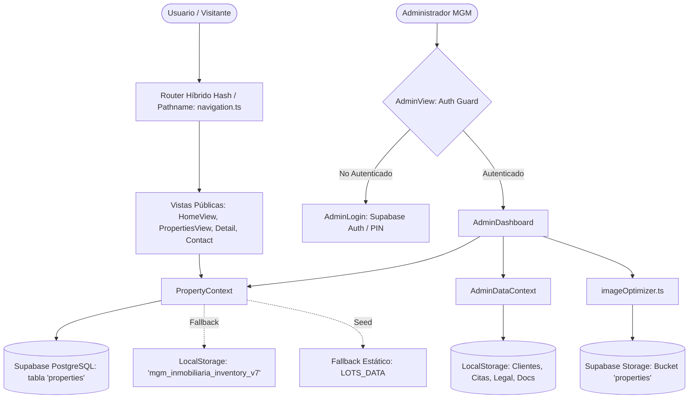

# PROJECT CONTEXT — Sociedad Civil MGM Inmobiliaria

> **Documento de Contexto y Diagnóstico Arquitectónico Oficial**  
> Generado y validado a partir de inspección real del código fuente (Next.js 15 + Vite 8 + React 19 + TypeScript + Supabase + Tailwind CSS v4).

---

## 1. Información General

- **Nombre del proyecto**: Sociedad Civil MGM Inmobiliaria
- **Objetivo**: Plataforma web de comercialización inmobiliaria, visualización de proyectos urbanizados y gestión administrativa integral de lotes, viviendas, clientes, citas, expedientes legales y documentos con crédito directo en Ecuador (Azuay / Cuenca / Manta).
- **Tipo de aplicación**: Web SPA híbrida (Frontend desarrollado sobre estructura Next.js 15 App Router pero ejecutado y empaquetado principalmente mediante Vite 8.3.0 como Single Page Application de alto rendimiento).
- **Hosting y Despliegue**: Firebase Hosting (`sociedadmgminmobiliaria.web.app`), configurado en `firebase.json` (`public: "out"`, rewrite total hacia `/index.html`).
- **Usuarios principales**:
  1. *Compradores / Inversionistas*: Consulta de catálogo, simulación de cuotas de financiamiento directo, agendamiento de visitas a campo y contacto vía WhatsApp.
  2. *Propietario / Administradores de MGM*: Control del catálogo inmobiliario, estado de lotes, registro de clientes interesados, agenda de visitas, control de expedientes notariales y descarga de reportes.
- **Estado actual del proyecto**: 100% funcional y operativo. Compilación limpia sin errores de tipos (`tsc --noEmit` y `vite build` en 5.8s). Servidor local en `http://localhost:3005/`.

---

## 2. Stack Tecnológico

| Capa / Área | Tecnología / Librería | Versión | Propósito / Rol |
| :--- | :--- | :--- | :--- |
| **Bundler / Runtime** | [Vite](https://vitejs.dev/) | `^8.3.0` | Dev server principal (`port: 3005`) y compilador de producción hacia `out/` |
| **Framework Base** | [Next.js](https://nextjs.org/) | `^15.4.9` | Estructura de vistas, rutas y layout en `app/` |
| **Lenguaje** | [TypeScript](https://www.typescriptlang.org/) | `5.9.3` | Tipado estático estricto en toda la aplicación |
| **Librería UI** | [React](https://react.dev/) / [React DOM](https://react.dev/) | `^19.2.1` | Motor de componentes e interfaces interactivas |
| **Estilos & Diseño** | [Tailwind CSS](https://tailwindcss.com/) | `4.1.11` | Diseño responsivo, tokens de color esmeralda institucional (`#113d22`, `#22A33D`) |
| **Procesador CSS** | `@tailwindcss/postcss` + `postcss` | `8.5.6` | Motor de procesamiento de estilos |
| **Animaciones** | `motion` (Framer Motion) | `^12.23.24` | Transiciones fluidas, animaciones de entrada y modales |
| **Iconografía** | `lucide-react` | `^0.553.0` | Iconos vectoriales del sistema |
| **Cartografía** | `leaflet` + `@types/leaflet` | `^1.9.4` | Mapas interactivos para localización y coordenadas |
| **Base de Datos** | [Supabase](https://supabase.com/) (PostgreSQL 17) | `^2.116.0` | Persistencia en nube de propiedades con sincronización Realtime |
| **Almacenamiento** | Supabase Storage (Bucket `properties`) | N/A | Repositorio de imágenes y documentos |
| **Optimización Medios** | Compresión Canvas a WebP | Nativo TS | Conversión en caliente de imágenes a WebP (ahorro 70-85%) |
| **Despliegue** | Firebase Hosting | CLI v15 | Despliegue estático SPA con cabeceras de caché y seguridad |

---

## 3. Arquitectura del Sistema

La aplicación está diseñada bajo un enfoque SPA desacoplado donde la interfaz de usuario se nutre de dos contextos de estado especializados, complementados con sincronización remota en Supabase y persistencia local de respaldo.



### Flujo de Ejecución y Montaje
1. `index.html` carga como punto de entrada Vite `/src/main.tsx`.
2. `src/main.tsx` monta `<HomePage />` (`app/page.tsx`) en el elemento `#root`.
3. `app/page.tsx` envuelve la aplicación en `<PropertyProvider>` y orquesta la vista activa mediante `currentPage` y listeners bidireccionales de URL (`hashchange` y `popstate`).
4. Si la vista activa es `admin`, se monta `<AdminView>`, la cual envuelve el panel en `<AdminDataProvider>` tras validar el inicio de sesión.

---

## 4. Estructura de Carpetas y Organización

```text
d:\Codespace\Trabajos\MGM\
├── app/                              # Estructura Next.js App Router
│   ├── globals.css                   # Tokens de Tailwind CSS v4 y estilos globales
│   ├── layout.tsx                    # Metadatos raíz y SEO
│   ├── not-found.tsx                 # Manejador de error 404
│   ├── opengraph-image.tsx           # Generador dinámico de imagen social
│   ├── page.tsx                      # Orquestador maestro de vistas públicas y panel
│   └── privacy/                      # Ruta canónica de políticas de privacidad
├── src/
│   ├── main.tsx                      # Punto de entrada de Vite para montaje en #root
│   ├── components/                   # Biblioteca de componentes React
│   │   ├── admin/                    # Módulos del Panel Administrativo
│   │   │   ├── AdminAppointmentsView.tsx      # Agenda de citas (Lista y Calendario)
│   │   │   ├── AdminClientsView.tsx           # Gestión de clientes e interesados
│   │   │   ├── AdminDashboard.tsx             # Layout maestro (Sidebar, Topbar, Tabs)
│   │   │   ├── AdminDashboardOverview.tsx     # Dashboard con KPIs y actividad reciente
│   │   │   ├── AdminDocumentsView.tsx         # Gestor centralizado de documentos y subida
│   │   │   ├── AdminGlobalSearchModal.tsx     # Buscador cruzado omnibox (Ctrl+K)
│   │   │   ├── AdminLegalFilesView.tsx        # Expedientes legales y verificación notarial
│   │   │   ├── AdminLogin.tsx                 # Formulario de login (Supabase / PIN)
│   │   │   ├── AdminNotificationsDropdown.tsx # Campana de notificaciones con badges
│   │   │   ├── AdminPropertiesList.tsx        # Catálogo admin con filtros y botón destacado
│   │   │   ├── AdminPropertyModal.tsx         # Formulario modal/pantalla de propiedad
│   │   │   ├── AdminReportsView.tsx           # Estadísticas operativas y exportación CSV
│   │   │   └── AdminSettingsView.tsx          # Parámetros comerciales y de crédito
│   │   ├── common/                   # Componentes de soporte
│   │   │   ├── AnimatedInsignia.tsx           # Distintivo visual animado
│   │   │   ├── Image.tsx                      # Shim de compatibilidad para next/image en Vite
│   │   │   ├── InteractiveMapPicker.tsx       # Selector de coordenadas geográficas Leaflet
│   │   │   └── ScrollReveal.tsx               # Wrapper de animación al hacer scroll
│   │   ├── modals/                   # Modales de interacción
│   │   │   └── LegalModal.tsx                 # Modal de términos, privacidad y cookies
│   │   ├── ui/                       # Componentes de UI atómicos
│   │   │   └── circular-gallery.tsx           # Galería interactiva circular
│   │   └── views/                    # Vistas de página principales
│   │       ├── AboutView.tsx                  # Trayectoria institucional y respaldo jurídico
│   │       ├── AdminView.tsx                  # Guardián de autenticación y wrapper de admin
│   │       ├── ContactView.tsx                # Canales de atención, mapas y WhatsApp
│   │       ├── HomeView.tsx                   # Portada principal y propuesta comercial
│   │       ├── NewPropertyView.tsx            # Formulario autónomo de publicación
│   │       ├── PrivacyView.tsx                # Página completa de privacidad LOPDP
│   │       ├── PropertiesView.tsx             # Catálogo público con filtros avanzados
│   │       └── PropertyDetailView.tsx         # Ficha detallada de lote/vivienda
│   ├── context/                      # Gestión de estado global (React Context)
│   │   ├── AdminDataContext.tsx              # Estado de clientes, citas, legal y docs
│   │   └── PropertyContext.tsx               # Estado de inventario, KPIs y sincronización
│   ├── data/                         # Modelos y datos
│   │   ├── adminTypes.ts                     # Interfaces TypeScript de administración
│   │   ├── lots.ts                           # Interface LotProperty y dataset inicial LOTS_DATA
│   │   └── navigation.ts                     # Definición de rutas y slugs (PAGES_CONFIG)
│   └── lib/                          # Capa de infraestructura y utilidades
│       ├── imageOptimizer.ts                 # Optimizador Canvas a WebP y subida a Storage
│       └── supabase.ts                       # Cliente Supabase y mappings relacionales
├── docs/                             # Documentación viva y especificaciones
│   ├── DEVELOPMENT_RULES.md          # Reglas obligatorias de desarrollo
│   └── PROJECT_CONTEXT.md            # Este documento de contexto técnico
├── public/                           # Archivos estáticos, logos, dossier y PDFs
├── index.html                        # Plantilla HTML base consumida por Vite
├── vite.config.mts                   # Configuración de Vite con alias @ y shims
├── next.config.ts                    # Configuración de soporte Next.js
├── firebase.json                     # Reglas de hosting y caché en Firebase
└── package.json                      # Dependencias y scripts del proyecto
```

---

## 5. Rutas de la Aplicación

La navegación principal utiliza el resolver `resolvePageFromHash` (`src/data/navigation.ts`) con sincronización bidireccional entre el hash (`#slug`) y el pathname HTML5 (`/slug`):

| Slug / Hash | Vista Asociada | Acceso | Propósito |
| :--- | :--- | :---: | :--- |
| `/` o `/#inicio` | `HomeView` | Público | Portada, héroe de proyectos, propuesta de valor, calculadoras |
| `/#lotes` | `PropertiesView` | Público | Catálogo interactivo de lotes y viviendas con filtros |
| `/#nosotros` | `AboutView` | Público | Respaldo jurídico notarial, trayectoria de MGM |
| `/#contacto` | `ContactView` | Público | Asesoría personalizada, mapa de oficinas, WhatsApp |
| `/#lote/:id` o `/lote/:id` | `PropertyDetailView` | Público | Ficha técnica completa, medidas, fotos y cotización |
| `/#privacidad` o `/privacy` | `PrivacyView` | Público | Políticas de privacidad LOPDP, términos y cookies |
| `/#admin` | `AdminView` -> `AdminDashboard` | Protegido | Panel administrativo integral de 9 secciones |
| `/#new_property` | `NewPropertyView` | Protegido | Formulario independiente de publicación de lote |

---

## 6. Sistema de Autenticación y Autorización

### Implementación Actual
- **Ubicación**: `src/components/views/AdminView.tsx` y `src/components/admin/AdminLogin.tsx`.
- **Mecanismos soportados**:
  1. *Supabase Auth*: Autenticación con email y contraseña mediante `supabase.auth.signInWithPassword`.
  2. *Bypass por PIN Local*: Validación contra constantes de código (`mgm2026`, `admin1234`).
- **Persistencia de sesión**:
  - `localStorage.setItem('mgm_admin_authenticated', 'true')` o `sessionStorage`.
  - `localStorage.setItem('mgm_admin_user_email', email)`.
  - Escucha reactiva en `supabase.auth.onAuthStateChange`.
- **Cierre de sesión**:
  - `supabase.auth.signOut()`, eliminación de claves en almacenamiento y reseteo de estado.

---

## 7. Base de Datos y Persistencia

### Instancia Supabase
- **URL**: `https://ospsnohsrhmqtnyfndhh.supabase.co`
- **Motor**: PostgreSQL 17 en Supabase Cloud.

### Tabla Principal: `properties`
Almacena el catálogo de inmuebles y sus especificaciones técnicas:
- `id` (text, PK)
- `code` (text, único, ej. `VM-101`, `MT24-023`)
- `name` (text, nombre comercial)
- `project` (text, ej. `Ciudadela Miravalle`, `San Antonio · Manta`)
- `type` (text, `'Lote de Terreno' | 'Vivienda' | 'Proyecto en Planos'`)
- `category` (text, `'Residencial' | 'Esquinero' | 'Comercial' | 'Campestre'`)
- `area_m2`, `dimensions`, `price_usd`, `min_down_payment_usd`, `estimated_monthly_usd`, `max_months`
- `status` (`'Disponible' | 'En Reserva' | 'Vendido' | 'Inactiva'`)
- `topography`, `zone`, `orientation`, `registry_status`, `description`
- `features` (jsonb/array de strings)
- `image` (text, URL de portada)
- `gallery` (jsonb/array de URLs)
- `beds`, `baths`, `parking_spaces`, `floors`, `age_years`
- `pdf_url`, `pdf_title` (vinculación directa de documentos/planos)
- `documents` (jsonb array con metadata documental)

### Tablas Administrativas (Actualmente en LocalStorage)
Los datos de las entidades administrativas se gestionan en `AdminDataContext.tsx` mediante claves de `localStorage`:
- `mgm_admin_clients_v1`: Clientes e interesados.
- `mgm_admin_appointments_v1`: Agenda de citas y visitas.
- `mgm_admin_legal_files_v1`: Expedientes legales notariales.
- `mgm_admin_documents_v1`: Gestor documental centralizado.
- `mgm_admin_activity_v1`: Bitácora de actividades operativas.
- `mgm_admin_notifications_v1`: Alertas y notificaciones del sistema.

---

## 8. Almacenamiento de Archivos (Storage)

- **Servicio**: Supabase Storage, bucket público `properties`.
- **Ubicación de lógica**: `src/lib/imageOptimizer.ts`.
- **Estructura de rutas en Storage**:
  - Imágenes: `properties/{CODE}/{TIMESTAMP}-{SLUG}.webp`
  - Documentos / PDFs: `documents/{CODE}/{TIMESTAMP}-{FILENAME}.ext`
- **Optimizador de Imágenes Integrado**:
  - Las imágenes se cargan en un elemento `<canvas>` en el navegador, se redimensionan a un máximo de 1440x1440px y se comprimen a formato WebP con calidad 0.80 antes de transmitirse.
  - Genera ahorros del 70% al 85% en ancho de banda y cuota de almacenamiento.

---

## 9. Modelos de Datos (Interfaces TypeScript)

### `LotProperty` (`src/data/lots.ts`)
```typescript
export interface LotProperty {
  id: string;
  code: string;
  name: string;
  project: string;
  type: 'Lote de Terreno' | 'Vivienda' | 'Proyecto en Planos';
  category: 'Residencial' | 'Esquinero' | 'Comercial' | 'Campestre';
  areaM2: number;
  dimensions: string;
  priceUSD: number;
  minDownPaymentUSD: number;
  estimatedMonthlyUSD: number;
  maxMonths: number;
  topography: string;
  status: 'Disponible' | 'En Reserva' | 'Vendido' | 'Inactiva';
  zone: string;
  features: string[];
  description: string;
  orientation: string;
  registryStatus: string;
  image: string;
  gallery: string[];
  beds?: number;
  baths?: number;
  parkingSpaces?: number;
  floors?: number;
  ageYears?: number;
  address?: string;
  services?: string[];
  terrainFront?: number;
  terrainDepth?: number;
  terrainType?: string;
  landUse?: string;
  accessibility?: string;
  additionalTerrainInfo?: string;
  pdfUrl?: string;
  pdfTitle?: string;
  documents?: { title: string; url: string; size?: string; description?: string }[];
}
```

### `Client`, `Appointment`, `LegalFile`, `SystemDocument` (`src/data/adminTypes.ts`)
- **`Client`**: `id`, `name`, `phone`, `email`, `interestedPropertyIds`, `status` (`'Nuevo' | 'Contactado' | 'En negociación' | 'Cerrado' | 'No interesado'`), `notes`, `createdAt`.
- **`Appointment`**: `id`, `clientId`, `clientName`, `clientPhone`, `propertyId`, `propertyTitle`, `date`, `time`, `status` (`'Pendiente' | 'Confirmada' | 'Realizada' | 'Cancelada'`), `notes`, `createdAt`.
- **`LegalFile`**: `id`, `propertyId`, `propertyCode`, `propertyTitle`, `status` (`'Pendiente' | 'En revisión' | 'Completo' | 'Con observaciones'`), `requiredDocs: LegalDocRequirement[]`, `notes`, `updatedAt`.
- **`SystemDocument`**: `id`, `name`, `type` (`'Escritura' | 'Contrato' | 'Plano' | 'Cédula' | 'Certificado' | 'Ficha Técnica' | 'Otro'`), `propertyId`, `propertyCode`, `url`, `size`, `uploadedAt`, `status`.

---

## 10. Matriz de Funcionalidades y Estado

| Módulo / Funcionalidad | Estado | Archivos Principales Relacionados |
| :--- | :---: | :--- |
| **Catálogo Público de Lotes** | `IMPLEMENTADO` | `PropertiesView.tsx`, `PropertyCard.tsx`, `PropertyContext.tsx` |
| **Ficha Detallada de Inmueble** | `IMPLEMENTADO` | `PropertyDetailView.tsx`, `WhatsAppFAB.tsx`, `VisitModal.tsx` |
| **Calculadora de Crédito Directo** | `IMPLEMENTADO` | `InvestmentCalculator.tsx`, `PropertyDetailView.tsx` |
| **Agendamiento de Visitas** | `IMPLEMENTADO` | `VisitModal.tsx`, `AdminAppointmentsView.tsx` |
| **Dashboard Administrativo** | `IMPLEMENTADO` | `AdminDashboard.tsx`, `AdminDashboardOverview.tsx` |
| **Gestión de Propiedades (Admin)** | `IMPLEMENTADO` | `AdminPropertiesList.tsx`, `AdminPropertyModal.tsx` |
| **Gestión de Clientes** | `IMPLEMENTADO` | `AdminClientsView.tsx`, `AdminDataContext.tsx` |
| **Agenda de Citas y Visitas** | `IMPLEMENTADO` | `AdminAppointmentsView.tsx`, `AdminDataContext.tsx` |
| **Expedientes Legales Notariales** | `IMPLEMENTADO` | `AdminLegalFilesView.tsx`, `AdminDataContext.tsx` |
| **Gestor Central de Documentos** | `IMPLEMENTADO` | `AdminDocumentsView.tsx`, `imageOptimizer.ts` |
| **Reportes y Exportación CSV** | `IMPLEMENTADO` | `AdminReportsView.tsx` |
| **Configuración Comercial** | `IMPLEMENTADO` | `AdminSettingsView.tsx` |
| **Búsqueda Global Omnibox (`Ctrl+K`)**| `IMPLEMENTADO` | `AdminGlobalSearchModal.tsx`, `AdminDashboard.tsx` |
| **Sistema de Notificaciones** | `IMPLEMENTADO` | `AdminNotificationsDropdown.tsx`, `AdminDataContext.tsx` |
| **Optimización WebP en Caliente** | `IMPLEMENTADO` | `imageOptimizer.ts` |
| **Persistencia SQL de Clientes/Citas**| `PENDIENTE` | Requiere crear tablas en Supabase para migrar desde LocalStorage |
| **Envío automatizado de Emails/SMS**| `PENDIENTE` | Requiere integración con Resend, Twilio o webhook |

---

## 11. Problemas Encontrados y Deuda Técnica

1. **Dualidad de Formularios de Propiedad**:
   - Existen dos implementaciones casi gemelas para registrar propiedades: `AdminPropertyModal.tsx` (888 líneas) y `NewPropertyView.tsx` (775 líneas). La ruta `new_property` debería redirigir al panel o unificar su lógica.
2. **Dependencias Fantasma en `package.json`**:
   - `@google/genai`, `@hookform/resolvers`, `class-variance-authority`, `tailwind-merge` están declaradas en `dependencies` pero no se importan en ningún archivo del código activo.
3. **Persistencia Híbrida Asimétrica**:
   - Las propiedades se sincronizan con Supabase PostgreSQL, pero los clientes, citas, expedientes y bitácora administrativa se guardan únicamente en el `localStorage` del navegador. Si el administrador abre el panel desde otro equipo o borra la caché, estos datos no estarán disponibles.
4. **Tamaño del Bundle de Producción**:
   - `out/assets/index-*.js` pesa ~1,040 kB debido a que vistas completas (`HomeView`, `PropertiesView`, `AdminDashboard`) no están divididas con `React.lazy()` / code-splitting.

---

## 12. Riesgos de Seguridad Detectados

1. **Bypass de Autenticación en Cliente**:
   - En `src/components/admin/AdminLogin.tsx`, existen PINs hardcodeados en texto plano (`DEFAULT_PIN = 'mgm2026'`, `BACKUP_PIN = 'admin1234'`). Cualquier usuario con conocimientos básicos de inspección de código puede descubrir estas cadenas o manipular `localStorage.setItem('mgm_admin_authenticated', 'true')` para acceder a la interfaz.
2. **Claves de Supabase en Código Fuente**:
   - En `src/lib/supabase.ts`, la clave anónima (`anon key`) está incrustada como valor por defecto de respaldo. Aunque las anon keys están diseñadas para ser públicas, deben estar protegidas mediante políticas de seguridad a nivel de fila (Row Level Security - RLS).
3. **Validación de Políticas RLS**:
   - Se debe verificar que la tabla `properties` y el bucket de Storage tengan políticas RLS que impidan a usuarios sin sesión válida de Supabase Auth ejecutar sentencias `INSERT`, `UPDATE` o `DELETE`.

---

## 13. Variables de Entorno Necesarias

| Variable | Tipo | Obligatoria | Descripción |
| :--- | :--- | :---: | :--- |
| `VITE_SUPABASE_URL` | String | Sí | URL del proyecto Supabase (ej. `https://ospsnohsrhmqtnyfndhh.supabase.co`) |
| `VITE_SUPABASE_ANON_KEY` | String | Sí | Llave anónima pública JWT de Supabase |
| `NEXT_PUBLIC_SUPABASE_URL` | String | Opcional | URL para runtime Next.js |
| `NEXT_PUBLIC_SUPABASE_ANON_KEY`| String | Opcional | Anon key para runtime Next.js |
| `GEMINI_API_KEY` | String | No | Solo si se activa la integración con `@google/genai` |
| `APP_URL` | String | No | URL pública del despliegue en producción |

---

## 14. Recomendaciones Arquitectónicas para Futuros Cambios

1. **Migración de Tablas Administrativas a Supabase**:
   - Crear tablas SQL para `clients`, `appointments`, `legal_files` y `documents` en Supabase con sus correspondientes políticas RLS para lograr sincronización multi-dispositivo y respaldo definitivo en la nube.
2. **Aislamiento de la Autenticación**:
   - Retirar los PINs estáticos en cliente y basar el acceso exclusivamente en Supabase Auth (`email/password` o Magic Link), validando la sesión en el servidor o mediante guards con JWT activo.
3. **Unificación de Creación de Propiedades**:
   - Deprecar `NewPropertyView.tsx` y utilizar exclusivamente `AdminPropertyModal` dentro de `AdminDashboard` para evitar duplicación de mantenimiento.
4. **Code-Splitting y Carga Perezosa**:
   - Implementar `React.lazy()` en las vistas más pesadas (`AdminDashboard`, `PropertyDetailView`, `InteractiveMapPicker`) para reducir el chunk inicial de 1,040 kB a menos de 400 kB.
5. **Limpieza de Dependencias**:
   - Ejecutar desinstalación limpia de paquetes no utilizados (`@google/genai`, `@hookform/resolvers`, etc.) para sanear `package.json`.

---

## 15. Archivos Críticos que Debes Conocer Antes de Modificar el Proyecto

1. [`src/data/lots.ts`](file:///d:/Codespace/Trabajos/MGM/src/data/lots.ts): Modelo maestro `LotProperty` y catálogo de respaldo `LOTS_DATA`.
2. [`src/context/PropertyContext.tsx`](file:///d:/Codespace/Trabajos/MGM/src/context/PropertyContext.tsx): Proveedor central de datos de inventario y canal en tiempo real.
3. [`src/context/AdminDataContext.tsx`](file:///d:/Codespace/Trabajos/MGM/src/context/AdminDataContext.tsx): Estado y operaciones CRUD de clientes, citas, legal y documentos.
4. [`src/components/admin/AdminDashboard.tsx`](file:///d:/Codespace/Trabajos/MGM/src/components/admin/AdminDashboard.tsx): Núcleo visual del panel administrativo.
5. [`src/components/admin/AdminPropertyModal.tsx`](file:///d:/Codespace/Trabajos/MGM/src/components/admin/AdminPropertyModal.tsx): Formulario maestro para creación y edición de propiedades.
6. [`src/lib/supabase.ts`](file:///d:/Codespace/Trabajos/MGM/src/lib/supabase.ts): Conexión a base de datos y mapper relacional `mapPropertyToRow` / `mapRowToProperty`.
7. [`src/lib/imageOptimizer.ts`](file:///d:/Codespace/Trabajos/MGM/src/lib/imageOptimizer.ts): Motor de compresión a WebP y subida a Supabase Storage.
8. [`src/data/navigation.ts`](file:///d:/Codespace/Trabajos/MGM/src/data/navigation.ts): Configuración de rutas, slugs y títulos del navegador.
9. [`app/page.tsx`](file:///d:/Codespace/Trabajos/MGM/app/page.tsx): Orquestador maestro de la SPA.
10. [`vite.config.mts`](file:///d:/Codespace/Trabajos/MGM/vite.config.mts): Configuración de compilación, puertos y shims de compatibilidad.

---

## 16. Última Actualización

- **Fecha**: 2026-10-07
- **Autor**: Antigravity Software Architect
- **Resumen**: Diagnóstico arquitectónico integral exhaustivo del proyecto completado sin alteración de código funcional. Generación de documentación viva de contexto técnico.
